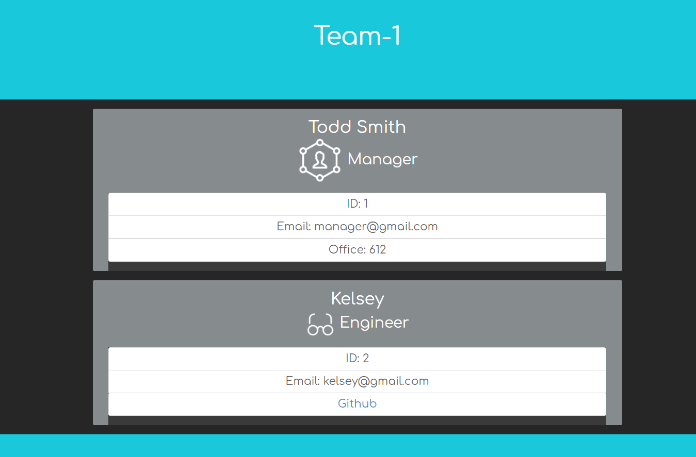

  
# Employee Team Generator

## Description 
The purpose of this project was to create a customizable team generator based on CLI inputs. 

## Project Demonstration
  

## Table of contents

- [Description](#description)
- [Installation](#installation)
- [Usage](#usage)
- [License](#license)
- [Contributing](#contributing)
- [Tests](#tests)
- [Questions](#questions)
- [Repository Link](#repository)

## Installation

        Step 1: Download my github, Step 2: Run Node Intstall NPM

## Usage

        Step 1: Run Node Index.js Step 2: Answer the questions presented about your team. Step 3: Look at the output file for your new team structure. 

## License
MIT 

2020 Permission is hereby granted, free of charge, to any person obtaining a copy of this software and associated documentation files (the Software), to deal in the Software without restriction, including without limitation the rights to use, copy, modify, merge, publish, distribute, sublicense, and/or sell copies of the Software, and to permit persons to whom the Software is furnished to do so, subject to the following conditions:The above copyright notice and this permission notice shall be included in all copies or substantial portions of the Software.THE SOFTWARE IS PROVIDED AS IS, WITHOUT WARRANTY OF ANY KIND, EXPRESS OR IMPLIED, INCLUDING BUT NOT LIMITED TO THE WARRANTIES OF MERCHANTABILITY, FITNESS FOR A PARTICULAR PURPOSE AND NONINFRINGEMENT. IN NO EVENT SHALL THE AUTHORS OR COPYRIGHT HOLDERS BE LIABLE FOR ANY CLAIM, DAMAGES OR OTHER LIABILITY, WHETHER IN AN ACTION OF CONTRACT, TORT OR OTHERWISE, ARISING FROM, OUT OF OR IN CONNECTION WITH THE SOFTWARE OR THE USE OR OTHER DEALINGS IN THE SOFTWARE.

## Contributing

The owner of this project is KJ-Labs, you're welcome to contribute.

## Tests

Yes, there are 4 test examples in the test folder. Please use NPM Run Test after you've downloaded the github repo. 

## Questions

- If you have any questions, please contact me on Github.
- [KJ-Labs](https://github.com/KJ-Labs)

## Repository

- [Project Repo](https://github.com/KJ-Labs/Employee-Summary-Generator)

## Screenshots
  

## External Credit: 
- Icons: https://icons8.com/icon/set/internet/dusk
- Background Image: https://www.vecteezy.com/vector-art/101253-free-abstract-background-1

